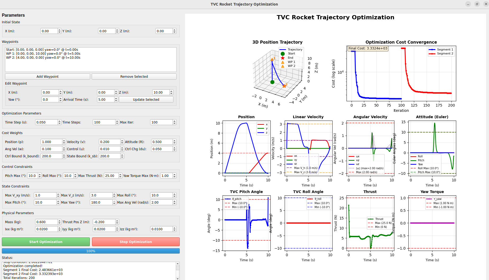

# TVC Rocket Trajectory Optimization

TVC (Thrust Vector Control) Rocket Trajectory Optimization using Crocoddyl optimal control library.

## Features

- **Trajectory Optimization**: Uses Crocoddyl's FDDP algorithm for trajectory optimization
- **Multi-Waypoint Planning**: Supports multiple waypoints with specified arrival times and yaw angles
- **Real-time GUI**: Interactive PyQt5 GUI for parameter adjustment and visualization
- **Comprehensive Constraints**: 
  - Control constraints (TVC pitch/roll angles, thrust, yaw torque)
  - State constraints (velocity, angles, angular velocity)
  - Separate horizontal and vertical velocity limits
- **Physical Parameters**: Configurable mass, moment of inertia, and thrust position

## Requirements

### Python Version
- Python 3.7+

### Main Dependencies
- `crocoddyl`: Optimal control library
- `numpy`: Numerical computing
- `matplotlib`: Visualization
- `PyQt5` or `PySide2`: GUI framework
- `pyyaml`: YAML configuration file parsing

## Installation

### Using conda (Recommended)

```bash
conda create -n tvc-opt python=3.10
conda activate tvc-opt
conda install -c conda-forge crocoddyl
pip install -r requirements.txt
```

### Using pip + virtualenv

```bash
python -m venv venv
source venv/bin/activate  # Linux/Mac
# or venv\Scripts\activate  # Windows
pip install -r requirements.txt
```

**Note**: `crocoddyl` may need to be installed via conda-forge on some systems.

## Project Structure

```
tvc-rocket-trajectory-optimization/
├── scripts/              # Executable scripts
│   ├── tvc_traj_opt.py   # Command-line optimization script
│   └── tvc_traj_opt_gui.py  # GUI application
├── models/               # Model files (URDF, SDF)
│   └── tvc/
├── config/               # Configuration files
│   └── default_params.yaml
├── results/              # Output directory
│   ├── trajectories/
│   ├── plots/
│   ├── videos/          # Generated videos
│   └── logs/
├── assets/               # Project resources
│   ├── images/          # Example/demo images
│   └── videos/          # Example/demo videos
```

## Usage

### GUI Application (Recommended)

```bash
python scripts/tvc_traj_opt_gui.py
```



The GUI allows you to:
- Set waypoints with positions, yaw angles, and arrival times
- Adjust cost weights and constraints
- Configure physical parameters
- Visualize optimization results in real-time

### Command-line Script

```bash
python -u scripts/tvc_traj_opt.py
```

Use `-u` flag for unbuffered output to see real-time iteration information.

## Waypoint Format

Waypoints are specified as: `[x, y, z, yaw_deg, arrival_time]`
- `x, y, z`: Position in meters
- `yaw_deg`: Yaw angle in degrees
- `arrival_time`: Arrival time in seconds

## Default Waypoints

- **Start**: [0.0, 0.0, 0.0, 0°, 0s]
- **Waypoint 1**: [0.0, 0.0, 10.0, 0°, 5s]
- **Waypoint 2**: [5.0, 0.0, 10.0, 0°, 10s]

## Configuration

### Physical Parameters
- Mass (kg)
- Moment of Inertia (Ixx, Iyy, Izz in kg·m²)
- Thrust Position (r_thrust_x, r_thrust_y, r_thrust_z in m)

### Constraints
- **Control Constraints**: TVC pitch/roll angles, thrust, yaw torque
- **State Constraints**: 
  - Horizontal velocity (m/s)
  - Vertical velocity (m/s)
  - Euler angles (roll, pitch, yaw in degrees)
  - Angular velocity (rad/s)

### Cost Weights
- Position (p)
- Velocity (v)
- Attitude (R)
- Angular Velocity (w)
- Control (u)
- Control Change (du)
- Constraint Penalties (k_bound, k_state_bound)

## Output

After optimization, the following are generated:
- **Visualization Plots**: Complete plots of all states, controls, and cost
- **Trajectory Data**: State and control trajectories

## TODO

- Add faster optimization method

## Author

Lei He
