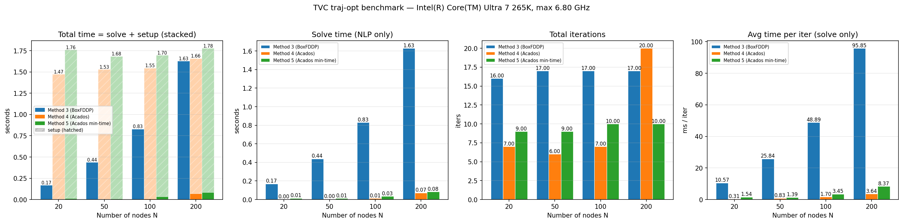

# TVC Rocket Trajectory Optimization
## GUI · Tracking · Onboard Feasibility · Flight Test

<!-- Insert: project / lab logo, hero photo of the rocket -->

Author · Date

---

## Outline

1. **GUI updates** — unified trajectory-optimization front-end
2. **Closed-loop tracking in simulation**
   - Traj1 (fixed-time) and Traj1 min-time
   - Traj2 (multi-waypoint): waypoint mode vs. optimization mode
3. **Cross-device benchmark** — onboard feasibility on Jetson Orin
4. **Real-flight demonstration** — Traj2 waypoint flight
5. Summary & next steps

---

## 1. GUI updates

- Single entry point (`tvc-traj-opt`, Qt5) exposing **7 solver back-ends**
  - Method 1–2: Crocoddyl / Pinocchio FDDP
  - **Method 3: BoxFDDP** — native control bounds
  - **Method 4: Acados** — native state & control constraints
  - **Method 5: Acados min-time** — per-segment free duration
  - Method 6–7: Spannagl FFTF / Acados free-$t_f$
- Multi-waypoint editor with per-row arrival time
- Three execution flavors per method: per-segment / unified shooting / waypoint terminal-cost
- Live cost & trajectory plots; auto CSV / JSON export of every solved run
- Save / load parameter presets (JSON)

<!-- Insert: GUI screenshot (full window + waypoint editor + live cost plot) -->

---

## 2. Problem setup (shared by all back-ends)

- **State** $x = [p, v, q, \omega] \in \mathbb{R}^{13}$, **Control** $u = [\theta_p, \theta_r, T, \tau_\text{yaw}] \in \mathbb{R}^{4}$
- **Dynamics**
  $\dot p = v,\quad m\dot v = R(q)\,R_\text{TVC}(\theta_p,\theta_r)\,[0,0,T]^\top + m g$
  $\dot q = \tfrac12\, q \otimes \omega,\quad I\dot\omega = r_T \times F_b + [0,0,\tau_\text{yaw}]^\top - \omega \times I\omega$
- **Active constraints in all experiments**
  - TVC angles $|\theta_p|, |\theta_r| \le 10^\circ$
  - Thrust $T \in [0, 25]$ N, $|\tau_\text{yaw}| \le 1$ N·m
  - Body rates $|\omega| \le 2$ rad/s, attitudes $|\phi|, |\theta| \le 10^\circ$, $|\psi| \le 30^\circ$

<!-- Insert: small schematic of TVC actuator / body frame -->

---

## 3. Traj1 — fixed-time vs. minimum-time

- **Traj1 (fixed):** point-to-point, duration 5 s, solver Method 4
  - Sim tracking RMS error < _ε_ cm; planned and tracked curves overlap
- **Traj1 min-time:** same start / goal, solver **Method 5**
  - Segment duration becomes a decision variable, $T_\text{seg} \in [0.15\text{ s}, T_\text{user}]$
  - Result: $T^\star \approx$ **2.0 s** (≈ 60 % faster than the 5 s baseline)
  - TVC angles and body rates saturate at limits → constraint-active solution

<!-- Insert: side-by-side 3D + time-history plots, identical axis scales -->

> Same constraints, same controller — min-time variant compresses the same task by ~60 %.

---

## 4. Traj2 — waypoint mode vs. optimization mode

- Multi-waypoint mission with $N$ waypoints (x, y, z, yaw, $t_\text{arr}$)
- **Waypoint mode (baseline):** controller switches setpoints directly between waypoints
  - Simple to deploy; aggressive at hand-offs; no constraint awareness
- **Optimization mode:** same waypoints fed to Method 4 with waypoint terminal-cost
  - Single smooth trajectory, all bounds respected

<!-- Insert: overlaid 3D trajectory of both modes -->
<!-- Insert: short comparison video (SITL) -->

---

## 5. Traj2 — quantitative comparison

| Metric                   | Waypoint mode | Optimization mode | Δ      |
|--------------------------|---------------|-------------------|--------|
| Total flight time (s)    | _to fill_     | _to fill_         | _−%_   |
| Peak attitude (deg)      | _to fill_     | _to fill_         | _−%_   |
| Peak body rate (rad/s)   | _to fill_     | _to fill_         | _−%_   |
| Position RMS error (m)   | _to fill_     | _to fill_         | _−%_   |
| Energy $\int T\,dt$ (N·s)| _to fill_     | _to fill_         | _−%_   |

<!-- Insert: dual-trace plots — position, attitude, control inputs -->

> Same mission, optimization mode → smoother attitude, lower control peaks, less energy.

---

## 6. Benchmark methodology

- Same OCP: $(0,0,0) \to (1,1,1)$, 5 s — Methods **3 / 4 / 5**, $N \in \{20, 50, 100, 200\}$
- Per trial we record:
  - **`setup_time`** — model export + OCP build + `AcadosOcpSolver()` instantiation
  - **`solve_time`** — pure `solver.solve()` (summed across segments)
  - **`total_time` = setup + solve**
  - SQP iterations from `solver.get_stats("sqp_iter")`
  - **`ms/iter`** = `solve_time / iters` → no setup pollution
- Outputs per CPU: CSV / JSON / `.npz` of every trajectory
- Plots regenerated **without rerunning the solver** via `plot_benchmark.py`

<!-- Insert: small data-pipeline diagram (benchmark_traj_opt.py → results/<cpu>/) -->

---

## 7. Benchmark results — Intel Core Ultra 7 265K

**Headline numbers at $N = 100$**

- Method 3 (BoxFDDP): solve **0.81 s**, **48 ms/iter**
- Method 4 (Acados tracking): solve **0.01 s**, **1.8 ms/iter**
- Method 5 (Acados min-time): solve **0.04 s**, **3.6 ms/iter**

**Take-aways**

- Acados setup ≈ 1.6 s (dominated by solver build, *not* solver math)
- Acados solve is 20–60× faster per iteration than BoxFDDP
- BoxFDDP setup ≈ 1 ms — negligible

---

## 8. Cross-device — Ultra 7 vs. Jetson Orin

<!-- Insert: grouped bar chart, x = N, color = method, two clusters = CPU -->
<!-- Insert: benchmark_<JetsonOrin_slug>.png once recorded -->

**Jetson Orin headline numbers (fill after running)**

- Method 3: solve _.. s_, _.. ms/iter_
- Method 4: solve _.. s_, _.. ms/iter_
- Method 5: solve _.. s_, _.. ms/iter_
- Per-iter slow-down vs. desktop: **_×k_**

**Two regimes to report separately**

- **Offline planning** (build + solve once): Orin finishes within _.. s_ — OK for pre-flight
- **Online MPC** (reuse solver, only `set yref` + `solve`): _.. Hz_ — OK for our control bandwidth

---

## 9. Onboard feasibility — takeaway

- All three methods fit Orin memory / runtime budget
- Method 4 / 5 deliver MPC-rate replanning **once the solver is warm**
- First-call Acados setup remains ~1–2 s → must be hidden in a boot-time warm-up
- **Next step:** integrate Acados as a long-lived ROS 2 / DDS node, solver instantiated once at startup

<!-- Insert: cartoon "warm-up + MPC loop" timeline -->

---

## 10. Real-flight demo — Traj2 (waypoint mode)

- Airframe: TVC rocket (PX4-TVC-NUS firmware) · IMU (BMI088 / ICM-…) · GPS / OptiTrack
- Same waypoints as the Traj2 SITL test
- Telemetry: full state + control logged at _.. Hz_

<!-- Insert: photo of the rocket on the pad -->
<!-- Insert: flight video -->

**Reported numbers (fill from log)**

- Tracking RMS error: _.. m_
- Max attitude deviation: _.. °_
- Max TVC angle / thrust usage: _.. ° / .. N_
- Total flight time: _.. s_

---

## 11. Sim-to-real consistency

- Overlay logged trajectory on the SITL trajectory (same waypoints)
- Residual offset in _.. axis_ → suspected cause: _.. (e.g. thrust calibration / CoM offset)_
- Within acceptable bounds for waypoint mode

<!-- Insert: 3D overlay + position-vs-time overlay (sim vs. real) -->

> Real flight reproduces the SITL behaviour → motivates flying the **optimization mode** next.

---

## 12. Summary & next steps

**Summary**

- Unified GUI with 7 solver back-ends, live monitoring, presets
- SITL tracking validated for Traj1, Traj1 min-time, Traj2
- Optimization mode beats waypoint mode in smoothness, peak control, and energy
- Acados solve-only times are 20–60× faster per iteration than BoxFDDP; Orin supports MPC-rate replanning when warm
- Real flight of Traj2 (waypoint mode) consistent with SITL

**Next steps**

1. Long-lived Acados solver node — eliminate per-replan setup
2. Real flight of **Traj2 optimization mode**
3. Min-time real flight (Method 5)
4. Disturbance-rejection benchmark (wind / payload change)
5. Broaden device benchmark (Pi 5, Khadas, additional Jetson variants)

---

## Q & A

- Repo: `TVC-traj-opt` · `PX4-TVC-NUS`
- Benchmark data: `benchmark/results/<cpu>/`
- Contact: _your email_

<!-- Insert: best hero shot or short looping video -->
